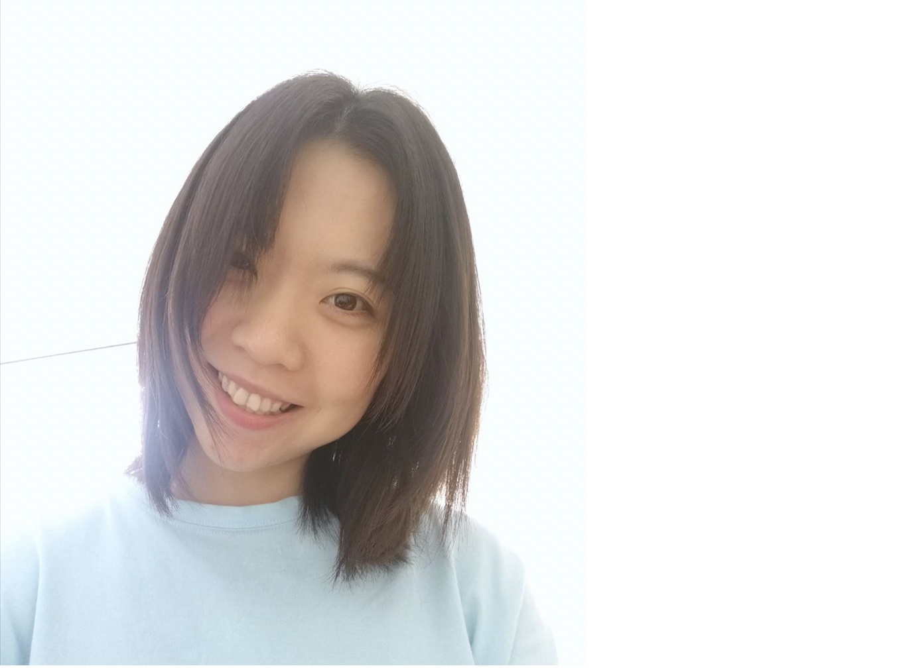

	
	ZI-YI DUAN (Zoe)
	 Ph.D. Student
		 Department of Psychology
	 New York University
	 <a href = "mailto:zoeduan.sci@gmail.com">✉️ zoeduan.sci@gmail.com</a> 

[CV](https://docs.google.com/document/d/1k58mSf4gRsOJBmFiCuKN0xaoHC--m2jIXktMbmoVUY0/edit?usp=sharing) | [Google Scholar](https://scholar.google.com/citations?user=2H9meH0AAAAJ&hl=zh-CN) | [Twitter](https://twitter.com/ZoeDuan2) | [Github](https://github.com/ZiyiDuan)

&nbsp;

Hi, I am Zoe! My Chinese name is Ziyi Duan(段紫逸), looking like a purple bunny in skateboarding. I am a prospective Ph.D. student in [ClaySpace Lab](https://www.clayspacelab.com/) in the Department of Psychology at New York University. Before that, I worked as a full-time RA in [Lewis-Peacock Lab](https://www.lewpealab.org/home) at The University of Texas at Austin, and did my undergraduate and master work with [Dr. Xiaowei Ding](https://psy.sysu.edu.cn/teacher/719) at Sun Yat-sen University (China).

&nbsp;

I want to be a cognitive neuroscientist as I am interested in the relationship between **brain-mind-behavior**. In particular, I am interested in **working memory (WM)**, a capacity-limited cognitive system, but with powerful functions. Here are some fundamental questions of WM that attracts me most.

>* How do our brains form working memory representations?
>* How do we use working memory to guide our behaviors?

My research combines psychophysics, eye-tracking, neuroimage (EEG, fMRI), machine learning, and computational modeling to explore these exciting research questions. I especially enjoy foraging scientific innovation by designing new experimental approaches and combining up-to-date techniques. I also want to contribute to clinical applications in mental and brain disorders. 

&nbsp;

If you want to know more about my research, please see **[Research](/research)** and my **[CV](https://docs.google.com/document/d/1TJdox0sSVh5sWYU8Gy4Vu34LtOKBbrN0pcIrhLedxMU/edit?usp=sharing)**. 

&nbsp;

I have created a [WM journal club](/journalClub) and try to update with both recent and classical important papers in this field. I have also put together some useful [resources](/archives), including tips for Ph.D. application, programing, statistics, computational modeling, etc.

Please <a href = "mailto: zoeduan.sci@gmail.com">reach out to me</a> if you have any questions or suggestions.

